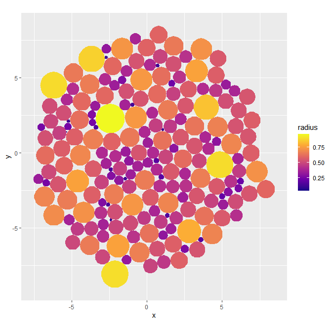
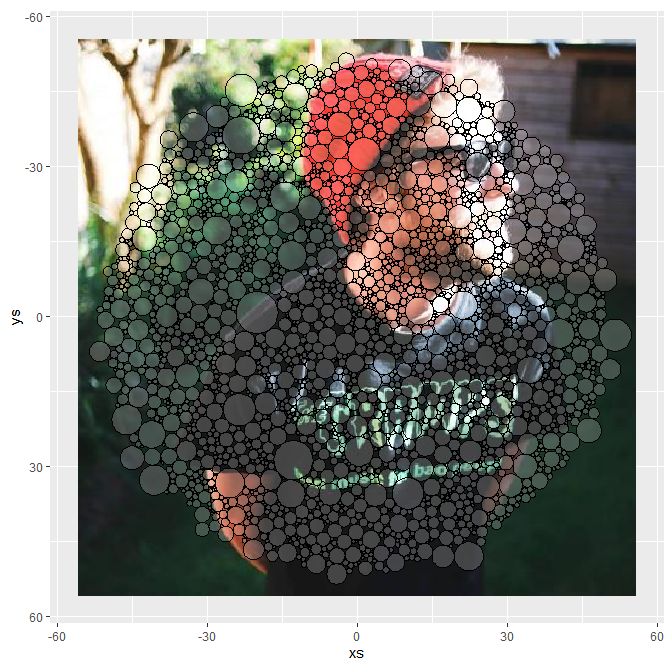
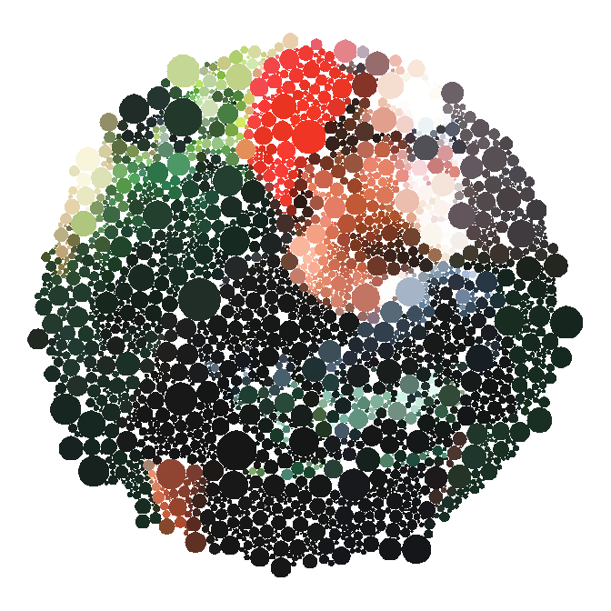

# Bubble pictures

An experiment in recreating images with filled circles. This didn’t
really work as well as I was hoping/expecting but am writing it up for
future reference. It’s a bit rough and ready but I dont think I will
spend any more time developing it.

``` r
library(tidyverse) # For all the data wrangling
library(magick) # To handle the image
library(packcircles) # To generate packed circle coordinates
library(gglcd) # My own package used for convenience here to plot circles
```

I use `gglcd::geom_lc()` in this code to plot the circles (and
squares/rectangles) for convenience as it already exists\!

Start by getting to grips with the `packcircles` package

``` r
packcircles::circleProgressiveLayout(rnorm(200) %>% abs()) %>% 
  ggplot()+
  gglcd::geom_lc(aes(x, y, 
                     length=radius*2, 
                     width=radius*2, 
                     angle=0, 
                     fill=radius), 
                 lc_shape = "ellipse",
                 col=NA)+
  coord_equal()+
  scale_fill_viridis_c(option = "plasma")
```

<!-- -->

Visualise ‘bubbles’ over the original image

``` r
# Read image
i <- image_read('github-avatar.jpg')

# Generate bubble packed circle coordinates
set.seed(1)
circles_df <- 
  packcircles::circleProgressiveLayout(rnorm(4000) %>% 
                                         abs() %>% 
                                         magrittr::raise_to_power(3)) %>%
  tibble()

# Compute the boundaries of the packed circle image 
max_r <- max(circles_df$radius)
min_x <- min(circles_df$x) - max_r
max_x <- max(circles_df$x) + max_r
min_y <- min(circles_df$y) - max_r
max_y <- max(circles_df$y) + max_r

# Normalise the image coordinates to match the packed circle coordinates and plot both
i %>%
  magick::image_raster() %>%
  mutate(xs = scales::rescale(x, to=c(min_x, max_x)),
         ys = scales::rescale(y, to=c(min_y, max_y))) %>%
  ggplot()+
  geom_raster(aes(xs, ys, fill=col))+
  scale_fill_identity()+
  gglcd::geom_lc(data = circles_df,
                 aes(x, y, length=radius*2, width=radius*2, angle=0), lc_shape = "ellipse", col=1, fill="white", alpha=1/5)+
  scale_y_reverse()+
  coord_equal()
```

<!-- -->

Wrangle the image into its RGB values

``` r
i_df <-
  i %>% 
  magick::image_raster() %>%
  tibble() %>% 
  mutate(xs = scales::rescale(x, to=c(min_x, max_x)),
         ys = scales::rescale(y, to=c(min_y, max_y))) %>% 
  select(xs, ys, col) %>% 
  mutate(r = map_int(col, ~col2rgb(.x)[1]),
         g = map_int(col, ~col2rgb(.x)[2]),
         b = map_int(col, ~col2rgb(.x)[3]))

head(i_df)
```

    ## # A tibble: 6 x 6
    ##      xs    ys col           r     g     b
    ##   <dbl> <dbl> <chr>     <int> <int> <int>
    ## 1 -55.7 -55.4 #6a4f24ff   106    79    36
    ## 2 -55.4 -55.4 #7b5f37ff   123    95    55
    ## 3 -55.2 -55.4 #836a42ff   131   106    66
    ## 4 -55.0 -55.4 #7f6743ff   127   103    67
    ## 5 -54.7 -55.4 #866f4fff   134   111    79
    ## 6 -54.5 -55.4 #9c876aff   156   135   106

Extract the image pixels contained in the maximal square that fits in
each circle and compute the average RGB new colour

``` r
plot_df <-
  circles_df %>% 
  mutate(x_box_min = x - radius,
         x_box_max = x + radius,
         y_box_min = y - radius,
         y_box_max = y + radius) %>% 
  mutate(new_col = pmap(list(x_box_min, x_box_max, y_box_min, y_box_max),
                        ~i_df %>% 
                          filter(between(xs, ..1, ..2),
                                 between(ys, ..3, ..4)) %>% 
                          summarise(r = median(r, na.rm=TRUE),
                                    g = median(g, na.rm=TRUE),
                                    b = median(b, na.rm=TRUE)))) %>%
  unnest(new_col) %>% 
  # Some circles return NA colours (maybe no pixels when filtering if the circle is really small)
  # So I filter them out here
  filter(!is.na(r), !is.na(g), !is.na(b)) %>% 
  mutate(new_col = pmap_chr(list(r,g,b), rgb, maxColorValue = 255))
```

Plot the circles filled with their new colour

``` r
plot_df %>% 
  ggplot()+
  # geom_raster(aes(xs, ys, fill=col))+
  scale_fill_identity()+
  gglcd::geom_lc(aes(x, y, 
                     length=radius*2, 
                     width=radius*2, 
                     angle=0, 
                     fill=new_col), 
                 lc_shape = "ellipse", 
                 col=NA)+
  scale_y_reverse()+
  coord_equal()+
  theme_void()
```

<!-- -->

Try squares and angle based on y position

``` r
plot_df %>% 
  mutate(an = scales::rescale(y, c(-180,180))) %>% 
  ggplot()+
  scale_fill_identity()+
  gglcd::geom_lc(aes(x, y, 
                     length = radius * 1.7, 
                     width = radius * 1.7, 
                     angle = an, 
                     fill = new_col), 
                 lc_shape = "rectangle", 
                 col=NA)+
  scale_y_reverse()+
  coord_equal()+
  theme_void()
```

<!-- -->
